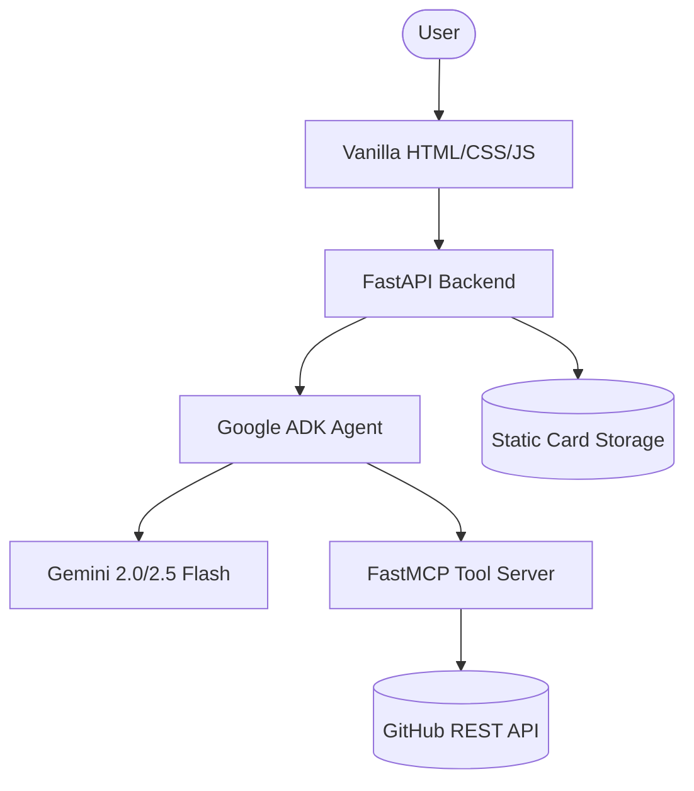

# 🔮 AI GitHub Dev Card Generator

[](https://fastapi.tiangolo.com)
[](https://ai.google.dev/)
[](https://www.docker.com/)
[](https://opensource.org/licenses/MIT)

**Transform your GitHub DNA into a stunning, AI-powered developer identity.**

The AI GitHub Dev Card Generator analyzes your engineering patterns, language distribution, and repository history to synthesize a premium, SaaS-style developer portfolio card. Powered by **Gemini 2.5 Flash**, **Google Agent SDK (ADK)**, and **FastMCP**.

---

## 🖼️ Screenshots

| Identity Synthesis | AI Archetype Analysis | Premium Visual Identity |
| :---: | :---: | :---: |
|  |  |  |

---

## ✨ Features

- **🧠 Autonomous AI Agent:** Powered by Google ADK and Gemini 2.5 Flash for deep engineering analysis.
- **🛡️ 10 Unique Archetypes:** From `Neon Operator` (Systems) to `AI Alchemist` (LLMs), the UI adapts to your DNA.
- **🧩 FastMCP Tooling:** Clean separation of concerns with a custom Model Context Protocol server.
- **🎨 Premium SaaS UI:** High-fidelity vanilla frontend inspired by Linear, Vercel, and Raycast.
- **📲 Interactive Sharing:** Integrated QR codes, Link sharing, and PNG/HTML export.
- **⚡ Performance First:** Built with Python 3.12, FastAPI, and `uv` for lightning-fast execution.

---

## 🏗️ Architecture



### The "Brain": ADK + MCP
The application utilizes a sophisticated **Autonomous Agent** architecture:
1.  **Google Agent SDK (ADK):** Orchestrates the high-level goals and maintains the generation state.
2.  **McpToolset:** Connects the Agent to specialized tools via **stdio transport**.
3.  **FastMCP Server:** Provides atomic tools for scraping, analyzing, and persisting developer data.

---

## 🚀 Getting Started

### Prerequisites
- Python 3.12+
- [uv](https://github.com/astral-sh/uv) (recommended)
- Docker & Docker Compose
- Google Gemini API Key ([AI Studio](https://aistudio.google.com/))
- GitHub Personal Access Token ([Classic](https://github.com/settings/tokens))

### Environment Variables
Create a `backend/.env` file:
```env
GEMINI_API_KEY=your_gemini_api_key
GITHUB_TOKEN=your_github_token
LOG_LEVEL=INFO
```

### Local Development
1. **Clone & Setup:**
   ```bash
   git clone https://github.com/yourusername/github-card-generator.git
   cd github-card-generator/backend
   uv pip install -r requirements.txt
   ```
2. **Run Backend:**
   ```bash
   uvicorn app.main:app --host 0.0.0.0 --port 8000 --reload
   ```
3. **Run Frontend:**
   Simply serve the `frontend/` directory using any static server (e.g., `npx serve frontend`).

### Docker Setup (Recommended)
Launch the entire ecosystem with one command:
```bash
docker-compose up --build
```
- **Frontend:** `http://localhost:8080`
- **Backend API:** `http://localhost:8000`

---

## ☁️ Cloud Run Deployment

This project is designed for seamless deployment to **Google Cloud Run**:

1. **Build Images:**
   ```bash
   gcloud builds submit --tag gcr.io/PROJECT_ID/gitcard-backend ./backend
   gcloud builds submit --tag gcr.io/PROJECT_ID/gitcard-frontend ./frontend
   ```
2. **Deploy Backend:**
   ```bash
   gcloud run deploy gitcard-backend \
     --image gcr.io/PROJECT_ID/gitcard-backend \
     --set-env-vars="GEMINI_API_KEY=...,GITHUB_TOKEN=..."
   ```
3. **Deploy Frontend:**
   ```bash
   gcloud run deploy gitcard-frontend \
     --image gcr.io/PROJECT_ID/gitcard-frontend \
     --set-env-vars="BACKEND_URL=https://your-backend-url.a.run.app"
   ```

---

## 📖 API Documentation

The backend provides a fully documented Swagger UI at `/docs`.

### `POST /api/generate`
Generates a new developer card.
- **Request Body:** `{"username": "torvalds"}`
- **Response:**
  ```json
  {
    "success": true,
    "image_url": "/static/cards/torvalds.html",
    "card_data": { ... }
  }
  ```

---

## 🛠️ Troubleshooting

- **GitHub Rate Limits:** Ensure you are using a valid `GITHUB_TOKEN` to avoid 403 errors.
- **Gemini Safety Filters:** Occasionally, very empty or "troll" profiles might trigger safety filters. The agent includes a fallback mechanism for these cases.
- **Docker Healthchecks:** If the frontend won't start, ensure the backend is healthy by checking `docker ps`.

---

## 🔮 Future Improvements

- [ ] **PDF Export:** Support for high-quality resume-ready PDF generation.
- [ ] **Custom Themes:** Allow users to override the AI-selected archetype.
- [ ] **Multi-Agent Collaboration:** A dedicated agent for "Engineering Review" of top repos.
- [ ] **Real-time Contributions:** Live heatmaps integrated into the card visual.

---

## ⚖️ License
Distributed under the MIT License. See `LICENSE` for more information.

Built with ❤️ by [Your Name]
