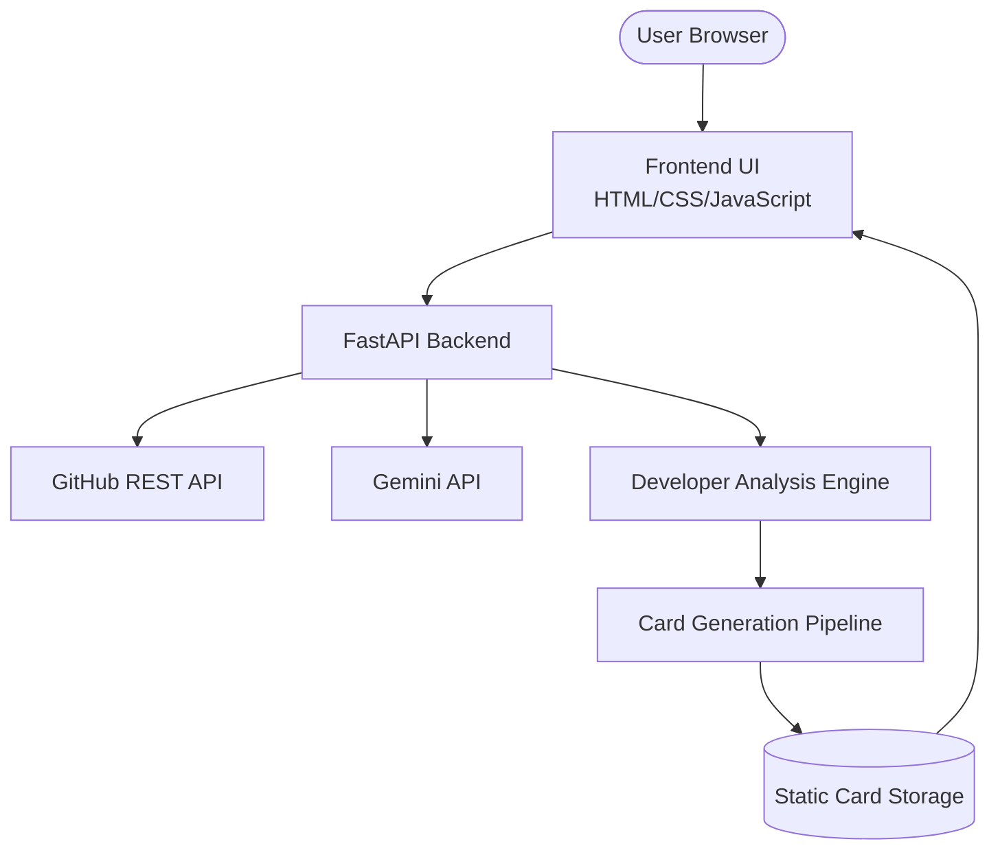

#  AI GitHub Dev Card Generator


[](https://ai.google.dev/)
[](https://www.docker.com/)


The AI GitHub Dev Card Generator analyzes your engineering patterns, language distribution, and repository history to synthesize a developer portfolio card.
Powered by **FastAPI**, **GitHub REST API**, **Gemini-powered developer analysis**, and **Dockerized infrastructure**.

---

## Features

- **AI-powered developer profile analysis**
- **10 Unique Archetypes:** From `Neon Operator` (Systems) to `AI Alchemist` (LLMs), the UI adapts to your DNA.
- **FastMCP Tooling:** Clean separation of concerns with a custom Model Context Protocol server.
-  **Premium SaaS UI:** High-fidelity vanilla frontend inspired by Linear, Vercel, and Raycast.
- **Interactive Sharing:** Integrated QR codes, Link sharing, and PNG/HTML export.

---

##  Architecture



##  Tech Stack

**Frontend:** HTML5, CSS3, Vanilla JavaScript  
**Backend:** FastAPI, Python 3.12, Uvicorn, httpx  
**APIs & AI:** GitHub REST API, Google Gemini API  
**Infrastructure:** Docker, Docker Compose, Nginx  
**Tools:** Git, GitHub, uv


##  Getting Started

### Prerequisites
- Python 3.12+
- [uv](https://github.com/astral-sh/uv) (recommended)
- Docker & Docker Compose
- Google Gemini API Key ([AI Studio](https://aistudio.google.com/))
- GitHub Personal Access Token ([Classic](https://github.com/settings/tokens))

### Environment Variables
Create a `backend/.env` file:
```env
GEMINI_API_KEY=your_gemini_api_key
GITHUB_TOKEN=your_github_token
```

### Local Development
1. **Clone & Setup:**
   ```bash
   git clone https://github.com/yourusername/github-card-generator.git
   cd github-card-generator/backend
   uv pip install -r requirements.txt
   ```
2. **Run Backend:**
   ```bash
   uvicorn app.main:app --host 0.0.0.0 --port 8000 --reload
   ```
3. **Run Frontend:**
   Simply serve the `frontend/` directory using any static server (e.g., `npx serve frontend`).

### Docker Setup (Recommended)
Launch the entire ecosystem with one command:
```bash
docker-compose up --build
```
- **Frontend:** `http://localhost:8080`
- **Backend API:** `http://localhost:8000`

---
##  Screenshots


---

## 📖 API Documentation

The backend provides a fully documented Swagger UI at `/docs`.

### `POST /api/generate`
Generates a new developer card.
- **Request Body:** `{"username": "torvalds"}`
- **Response:**
  ```json
  {
    "success": true,
    "image_url": "/static/cards/torvalds.html",
    "card_data": { ... }
  }
  ```

---

##  Troubleshooting

- **GitHub Rate Limits:** Ensure you are using a valid `GITHUB_TOKEN` to avoid 403 errors.

---
Built with ❤️ by Tejaswi
